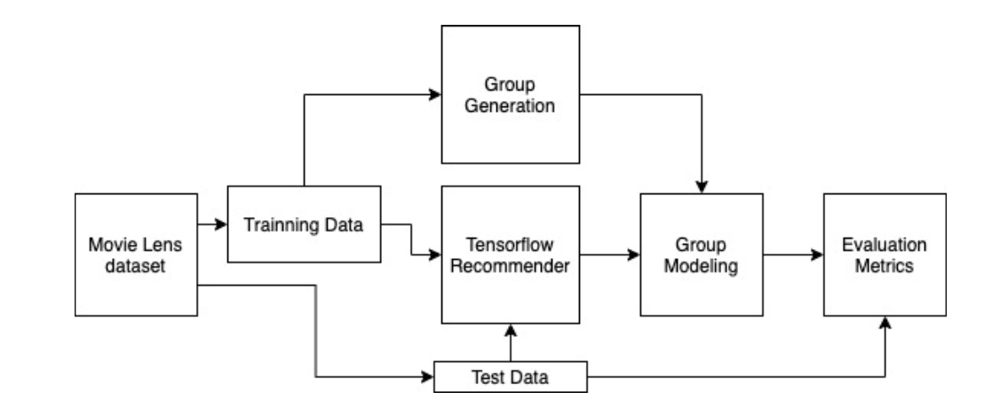

<!--[![Contributors][contributors-shield]][contributors-url]
[![Forks][forks-shield]][forks-url]
[![Stargazers][stars-shield]][stars-url]
[![Issues][issues-shield]][issues-url]
[![MIT License][license-shield]][license-url]
[![LinkedIn][linkedin-shield]][linkedin-url]-->


<!-- PROJECT LOGO -->
<br />
<p align="center">

  <h3 align="center">Fair Group Recommender Systems</h3>

  <p align="center">
    This project aims to benchmark the different "fair" group modeling strategies in the literature that are used in the group recommender systems.
    <br />
    <a href="https://github.com/jouuat/Fair-Group-Recommendation"><strong>Explore the docs »</strong></a>
    <br />
    <br />
    <a href="https://github.com/jouuat/Fair-Group-Recommendation">View Demo</a>
    ·
    <a href="https://github.com/jouuat/Fair-Group-Recommendation/issues">Report Bug</a>
    ·
    <a href="https://github.com/jouuat/Fair-Group-Recommendation/issues">Request Feature</a>
  </p>
</p>


<!-- TABLE OF CONTENTS -->
<details open="open">
  <summary><h2 style="display: inline-block">Table of Contents</h2></summary>
  <ol>
    <li><a href="#about-the-project">About The Project</a></li>
    <li><a href="#getting-started">Getting Started</a></li>
    <li><a href="#usage">Usage</a></li>
    <li><a href="#contributing">Contributing</a></li>
    <li><a href="#license">License</a></li>
    <li><a href="#contact">Contact</a></li>
  </ol>
</details>


<!-- ABOUT THE PROJECT -->
## About The Project

This project aims to benchmark the different "fair" group modeling strategies in the literature that are used in the group recommender systems. To do so, we've built the following pipeline:

<a href="">
    
</a>

Since there is not available any dataset with the hierarchy of the groups, the pipeline contains a "group building" module capable to construct synthetic groups according the Pearson Correlation Coefficient between the ratings of the users. In order to analyse the behaviour of the different group recommenders as widely as possible, user can specify how similar should be the users of each group:


* Random: Members of Random groups are selected with replacement from the set of users U with an uniform probability.
* Similar: (PCC > 0.3): randomly selects a user from U and then greedily select at random further users but only drawing them from those who have a PCC greater than 0.3.
* Divergent: (PPC < 0.1): Divergent strategy will try to create groups with divergent preferences by following the same strategy similar groups use but selecting now the users who have a PCC less than 0.1

Once groups are created, and recommender will compute the relevance of the items individually, we've built one using the tensorflow recomenders  package https://www.tensorflow.org/recommenders?hl=es-419.

Once the groups and the individual preferences are calculated, it's time to prove the different group modeling strategies, Keeping in mind the famous No Free Lunch (NFL) theorem ("There is no model that is a priori guaranteed to work better. The only way to know for sure which model is best is to evaluate them all. Since this is not possible, in practice we make some reasonable assumptions about the data and evaluate only a few reasonable models”), we have selected here some of the most recent fair group modeling techniques according to different criteria, such as the novelty introduced by these approaches, the relevance and the importance in the literature:

* Additive Utilitarian
* FAI aggregation strategy, proposed by Felfering et Al.
* Greedy Least Misery, proposed by Xiao et Al.
* X-Pareto Optimal, proposed by Dimitris Sacharidis
* Single Proportionality Greedy, proposed by Serbos et Al.
* Group Fairness-Aware Recommendation (GFAR), proposed by Mesut Kaya et Al.
* Adaptive Relevance-based Modeling, proposed by ourselves.
* Reputation Based Modeling, proposed by Guilherme et Al.

And the metrics used to evaluate the behaviour of the group modeling strategies are:

* Normalized Discounted Cumulative Gain, NDCG
* Zero Recall, Z-Recall
* Discounted First Hit, DFH
* Balanced Discounted Cumulative Gain, BNDCG (proposed by ourselves)


<!-- GETTING STARTED -->
## Getting Started

To get a local copy up and running follow these simple steps.

### Prerequisites

Make sure the same version of tensorflow recommeders is installed
* tensorflow-recommenders
  ```sh
  pip install tensorflow-recommenders==0.1.3
  ```

### Installation

1. Clone the repo
   ```sh
   git clone https://github.com/jouuat/Fair-Group-Recommendationgit
   ```
2. Install the required libraries
3. Run
    ```sh
    main.py config/config.txt
    ```
    where config/config.txt is the location of the configuration file


<!-- USAGE EXAMPLES -->
## Usage

Open the conguration file: config/config.txt and specify the desired settings of your Run, bare in mind that the parameters should be passed with the DAT format: ( variable = varaibleValue; or in case of a list: list = [ value1 value2 value3 ];)

Use this space to show useful examples of how a project can be used. Additional screenshots, code examples and demos work well in this space. You may also link to more resources.

_For more examples, please refer to the [Documentation](https://example.com)_


<!-- ROADMAP -->
## Roadmap

See the [open issues](https://github.com/github_username/repo_name/issues) for a list of proposed features (and known issues).


<!-- CONTRIBUTING -->
## Contributing

Contributions are what make the open source community such an amazing place to be learn, inspire, and create. Any contributions you make are **greatly appreciated**.

1. Fork the Project
2. Create your Feature Branch (`git checkout -b feature/AmazingFeature`)
3. Commit your Changes (`git commit -m 'Add some AmazingFeature'`)
4. Push to the Branch (`git push origin feature/AmazingFeature`)
5. Open a Pull Request


<!-- LICENSE -->
## License

Distributed under the MIT License. See `LICENSE` for more information.


<!-- CONTACT -->
## Contact

Project Link: [https://github.com/github_username/repo_name](https://github.com/github_username/repo_name)


<!-- MARKDOWN LINKS & IMAGES -->
<!-- https://www.markdownguide.org/basic-syntax/#reference-style-links -->
[contributors-shield]: https://img.shields.io/github/contributors/github_username/repo.svg?style=for-the-badge
[contributors-url]: https://github.com/github_username/repo/graphs/contributors
[forks-shield]: https://img.shields.io/github/forks/github_username/repo.svg?style=for-the-badge
[forks-url]: https://github.com/github_username/repo/network/members
[stars-shield]: https://img.shields.io/github/stars/github_username/repo.svg?style=for-the-badge
[stars-url]: https://github.com/github_username/repo/stargazers
[issues-shield]: https://img.shields.io/github/issues/github_username/repo.svg?style=for-the-badge
[issues-url]: https://github.com/github_username/repo/issues
[license-shield]: https://img.shields.io/github/license/github_username/repo.svg?style=for-the-badge
[license-url]: https://github.com/github_username/repo/blob/master/LICENSE.txt
[linkedin-shield]: https://img.shields.io/badge/-LinkedIn-black.svg?style=for-the-badge&logo=linkedin&colorB=555
[linkedin-url]: https://linkedin.com/in/github_username
